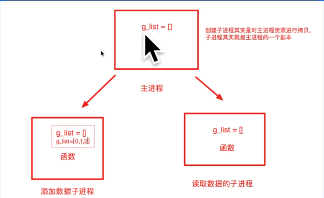

# 多任务

任务数大于cpu的核数表示并发的去执行多任务, 任务数小于等于cpu的核数表示并行的去执行多任务

### 进程
一个正在运行的程序或软件就是一个进程, 它是操作系统进行资源分配的基本单位, 也就是说每操作一个进程, 操作系统都会给其分配一定的运行资源(内存资源)保证进程的运行。

> 一个程序运行后至少有一个进程, 一个进程默认有一个线程, 进程里面可以创建多个线程, 线程是依附在进程里面的, 没有进程就没有线程。


#### 进程的使用

1. 导入进程包
```python
import multiprocessing
```

2. Process进程类的说明

- group： 指定进程组, 目前只能使用None
- target：执行的目标任务名
- name：进程名称
- args：以元组方式给执行任务传参
- kwargs：以字典方式给执行任务传参

process创建的实例对象的常用方法：
- start：启动子进程实例(创建子进程)
- join：等待子进程执行结束
- terminate：不管任务是否完成, 立即终止子进程

process创建的实例对象的常用属性：
- name: 当前进程的别名, 默认为Process-N, N从1开始递增的整数


```python
import multiprocessing
import time

def dance():
    for i in range(3):
        print('跳舞中...')
        time.sleep(0.2)

def sing():
    for i in range(3):
        print('唱歌中...')
        time.sleep(0.2)

if __name__ == '__main__':
    dance_process = multiprocessing.Process(target=dance)
    dance_process.start()
    
    # sing()
    
    # 改成另外一个子进程执行
    # 进程执行是无序的, 具体哪个先执行是由操作系统调度决定的
    sing_process = multiprocessing.Process(target=sing)
    sing_process.start()

```

```markdown
第一次 加载模块：主进程执行
主程序入口：只有主进程满足 __name__ == "__main__"
第二次 加载模块：子进程重新导入这个文件
子进程中 __name__ 不等于 "__main__"，所以不会执行主入口中的创建代码
最后执行 dance()
```


#### 获取进程的编号
获取进程的编号的目的是验证主进程和子进程的关系, 可以得知子进程是由哪个主进程创建出来的。

- 获取当前进程编号

```python
import os
os.getpid()
```

- 获取当前父进程编号
```python
import os
os.getppid()
```

#### 进程执行带有参数的任务
```python
import multiprocessing

def show_info(name, age):
    print(name, age)

    
if __name__ == '__main__':    
    # 创建子进程
    # 以元组方式传参, 元组里面的元素顺序要和函数的参数顺序保持一致, 没有顺序要求
    # sub_process = multiprocessing.Process(target=show_info, args = ("李四", 20))
    # sub_process = multiprocessing.Process(target=show_info, kwargs = {"name": '王五', "age": 20})
    sub_process = multiprocessing.Process(target=show_info, args = ("王五", ), kwargs = {"age": 20})

```


#### 进程的注意点

注意点介绍

- 进程间数据不共享
- 主进程会等待所有的子进程执行结束在结束

```python
import multiprocessing
import time

g_list = list()

def add_data():
    for i in range(3):
        # 因为列表是可变类型, 可以在原有内存的基础上修改数据, 并且修改后内存地址不变
        # 所以不需要加上global
        # 加上global 表示声明要修改全局变量的内存地址
        g_list.append(i)
        print('add:', i)
        time.sleep(0.2)
        
        
def read_data():
    print('read:', g_list)

# 提示：对于linux和mac主进程执行的代码不会进行拷贝, 但是对于window系统来说主进程执行的代码也会进行拷贝
# 对于window来说创建子进程的代码如果进程拷贝执行, 相当于递归无限制创建子进程, 会报错
# 解决window递归创建子进程, 通过判断是否是主模块来解决

# 理解说明：直接执行的模块就是主模块, 那么直接执行的模块里面就应该添加判断是否是主模块的代码
# 1. 防止别人导入文件的时候执行main里面的代码
# 2. 防止window系统递归创建子进程
if __name__ == '__main__':
    add_process = multiprocessing.Process(target=add_data)
    read_process = multiprocessing.Process(target=read_data)

    add_process.start()
    # 当前进程(主进程)等待添加数据的进程执行完成以后代码在继续往下执行
    add_process.join()
    print('main:', g_list)
    read_process.start()
```
> 创建子进程其实是对主进程资源进行拷贝, 子进程其实就是主进程的一个副本




```python
import multiprocessing
import time

def task():
    while True:
        print('xxx')
        time.sleep(0.2)

if __name__ == '__main__':
    sub_process = multiprocessing.Process(target=task)
    sub_process.daemon = True
    sub_process.start()
    
    time.sleep(0.5)
    # 退出主进程之前, 先让子进程进行销毁
    print("over")
    
# 结论：主进程会等待子进程执行完成以后程序在退出

# 解决办法：主进程退出子进程销毁
# 1. 让子进程设置成为守护进程, 主进程退出子进程销毁, 子进程依赖主进程
# 2. 让主进程退出之前先让子进程销毁

```